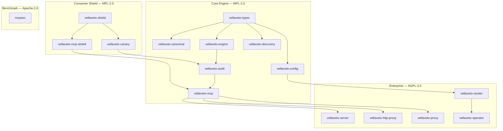

<p align="center">
  <h1 align="center">VellaVeto</h1>
  <p align="center">
    <strong>Runtime security engine for AI agent tool calls</strong>
  </p>
  <p align="center">
    Intercept &middot; Evaluate &middot; Enforce &middot; Audit
  </p>
  <p align="center">
    <a href="https://github.com/paolovella/vellaveto/releases"></a>
    <a href="https://github.com/paolovella/vellaveto/actions/workflows/ci.yml"></a>
    <a href="LICENSING.md"></a>
    <a href="https://www.rust-lang.org/"></a>
    
    
    <a href="https://modelcontextprotocol.io/specification/2025-11-25"></a>
    <a href="https://genai.owasp.org/resource/owasp-top-10-for-agentic-applications-for-2026/"></a>
    <a href="https://www.bestpractices.dev/projects/12042"></a>
  </p>
  <p align="center">
    <a href="#quick-start">Quick Start</a> &middot;
    <a href="#architecture">Architecture</a> &middot;
    <a href="#key-capabilities">Capabilities</a> &middot;
    <a href="#security">Security</a> &middot;
    <a href="#documentation">Docs</a>
  </p>
</p>

---

VellaVeto is a lightweight, high-performance firewall that sits between AI agents and their tools. It intercepts [MCP](https://modelcontextprotocol.io/) (Model Context Protocol) and function-calling requests, enforces security policies on paths, domains, and actions, and maintains a tamper-evident audit trail with SHA-256 hash chains and Ed25519 checkpoint signatures.

**Core guarantees:**
- **Complete mediation** — request and response paths evaluated before tool execution and before model return
- **Fail-closed** — no policy match, missing context, or evaluation error results in `Deny`
- **Tamper-evident audit** — SHA-256 hash chain + Merkle proofs + Ed25519 signed checkpoints
- **Public security contract** — [Security Guarantees](docs/SECURITY_GUARANTEES.md) + [Assurance Case](docs/ASSURANCE_CASE.md) with reproducible evidence

## What's New

- **Consumer Shield** (Phase 67) — New deployment mode for consumer AI interactions. PII sanitization, encrypted local audit, session isolation, warrant canary. [Details](CHANGELOG.md)
- **Three-tier licensing** — MPL-2.0 (core + consumer), Apache-2.0 (canary + benchmark), BUSL-1.1 (enterprise, converts to MPL-2.0 after 3 years). [Details](LICENSING.md)
- **232 adversarial audit rounds** — 1,550+ findings resolved across engine, MCP, server, audit, proxy, and discovery
- **8,790 tests passing** across Rust, Python, Go, TypeScript, Java + 24 fuzz targets

See [CHANGELOG.md](CHANGELOG.md) for full history.

## Why VellaVeto?

AI agents with tool access can read files, make HTTP requests, execute commands, and modify data. Without guardrails, a prompt injection or misbehaving agent can exfiltrate credentials, call unauthorized APIs, execute destructive commands, bypass restrictions via Unicode tricks or path traversal, launder data through tool responses, or impersonate tools via name squatting.

VellaVeto enforces security policies on every tool call before it reaches the tool server, scans every response before it reaches the model, and logs every decision to a tamper-evident audit trail. Trust math, not promises.

## Quick Start

### Setup Wizard

```bash
npx create-vellaveto
```

### MCP Stdio Proxy (Claude Desktop, local MCP servers)

```bash
cargo install vellaveto-proxy
vellaveto-proxy --config policy.toml -- /path/to/mcp-server
```

### HTTP Reverse Proxy (deployed MCP servers)

```bash
cargo install vellaveto-http-proxy
VELLAVETO_API_KEY=$(openssl rand -hex 32) vellaveto-http-proxy \
  --upstream http://localhost:8000/mcp \
  --config policy.toml \
  --listen 127.0.0.1:3001
```

### Docker

```bash
docker pull ghcr.io/paolovella/vellaveto:latest
docker run -p 3000:3000 \
  -v /path/to/config.toml:/etc/vellaveto/config.toml:ro \
  ghcr.io/paolovella/vellaveto:latest
```

### Minimal Policy (deny-by-default)

```toml
[[policies]]
name = "Allow file reads in /tmp"
tool_pattern = "file"
function_pattern = "read"
policy_type = "Allow"
priority = 100
[policies.path_rules]
allowed = ["/tmp/**"]

[[policies]]
name = "Default deny"
tool_pattern = "*"
function_pattern = "*"
policy_type = "Deny"
priority = 0
```

See [docs/QUICKSTART.md](docs/QUICKSTART.md) for framework integration guides (Anthropic, OpenAI, LangChain, LangGraph, CrewAI).

## How It Works

```
                    +------------------+
  AI Agent -------->|    VellaVeto     |--------> Tool Server
                    |                  |
                    |  1. Parse action |
                    |  2. Match policy |
                    |  3. Evaluate     |
                    |     constraints  |
                    |  4. Allow / Deny |
                    |  5. Audit log    |
                    +--------+---------+
                             |
                    Tamper-evident log
                    (SHA-256 chain +
                     Ed25519 signatures)
```

## Architecture



Lower crates never depend on higher crates. `vellaveto-operator` is standalone (kube-rs, no internal deps). See [CLAUDE.md](CLAUDE.md) for the full crate dependency graph.

## Key Capabilities

| Capability | What | Key Tech | Docs |
|---|---|---|---|
| **Policy Engine** | Glob/regex/domain matching, parameter constraints, time windows, call limits, action sequences, Cedar-style ABAC | Pre-compiled patterns, <5ms P99, decision cache, Wasm plugins | [Policy](docs/POLICY.md) |
| **Threat Detection** | Injection, tool squatting, rug pulls, schema poisoning, confused deputy, DLP, memory poisoning, multi-agent collusion | OWASP Agentic Top 10 coverage, Aho-Corasick, NFKC, Levenshtein | [Threat Model](docs/THREAT_MODEL.md) |
| **Auth & Access** | OAuth 2.1/JWT, ABAC with forbid-overrides, capability delegation, DPoP (RFC 9449), identity federation, least-agency, NHI lifecycle | Ed25519, OIDC/SAML, RBAC, continuous authorization | [IAM](docs/IAM.md) |
| **Audit & Compliance** | Tamper-evident logs, ZK proofs (Pedersen+Groth16), EU AI Act, SOC 2, DORA/NIS2, NIST AI 600-1, ISO 42001, OWASP MCP Top 10 | SHA-256 chains, Merkle proofs, ML-DSA-65 (PQC), evidence packs | [Security Guarantees](docs/SECURITY_GUARANTEES.md) |
| **Consumer Shield** | PII sanitization, encrypted local audit, session isolation, warrant canary | XChaCha20-Poly1305, Argon2id, per-session PII mapping | [Consumer Shield](examples/presets/consumer-shield.toml) |
| **Deployment** | 6 modes (HTTP, stdio, WebSocket, gRPC, gateway, consumer shield), K8s operator (3 CRDs), Helm, Terraform | All MCP transports, cross-transport fallback, distributed tracing | [Deployment](docs/DEPLOYMENT.md) |

## Security

VellaVeto has undergone **232 rounds of adversarial security auditing** covering 31+ attack classes mapped to the [OWASP Top 10 for Agentic Applications](https://genai.owasp.org/resource/owasp-top-10-for-agentic-applications-for-2026/).

- **Fail-closed everywhere** — empty policy sets, missing parameters, lock poisoning, capacity exhaustion, and evaluation errors all produce `Deny`
- **Zero `unwrap()` in library code** — all error paths return typed errors; panics reserved for tests only
- **Formal verification** — TLA+ (policy engine, ABAC, workflow, task lifecycle, cascading failure), Alloy (capability delegation), Kani (5 proof harnesses)
- **Post-quantum ready** — Hybrid Ed25519 + ML-DSA-65 (FIPS 204) audit signatures, feature-gated behind `pqc-hybrid`

**Known limitations:** Injection detection is a pre-filter, not a security boundary. DLP does not detect split secrets. No TLS termination (use a reverse proxy). See [Security Guarantees](docs/SECURITY_GUARANTEES.md) for the full normative contract.

Full details: [Security Guarantees](docs/SECURITY_GUARANTEES.md) | [Threat Model](docs/THREAT_MODEL.md) | [Assurance Case](docs/ASSURANCE_CASE.md)

## Deployment Modes

| Mode | Command | Use Case |
|---|---|---|
| HTTP API Server | `vellaveto serve` | Dashboard, REST API, policy management |
| MCP Stdio Proxy | `vellaveto-proxy` | Claude Desktop, local MCP servers |
| HTTP Reverse Proxy | `vellaveto-http-proxy` | Deployed MCP servers, SSE/Streamable HTTP |
| WebSocket Proxy | `vellaveto-http-proxy` | Bidirectional MCP-over-WS at `/mcp/ws` |
| gRPC Proxy | `vellaveto-http-proxy --grpc` | High-throughput, protobuf-native (feature-gated) |
| Consumer Shield | `vellaveto-shield` | User-side PII protection |

See [docs/DEPLOYMENT.md](docs/DEPLOYMENT.md) for configuration details.

## Documentation

### Getting Started

| Document | Description |
|---|---|
| [Quick Start](docs/QUICKSTART.md) | Framework integration guides (Anthropic, OpenAI, LangChain, LangGraph, MCP) |
| [15-Minute Secure Start](docs/SECURE_QUICKSTART_15_MIN.md) | End-to-end deny-by-default walkthrough with audit verification |
| [Policy Configuration](docs/POLICY.md) | Policy syntax, operators, presets, elicitation, sampling, DLP |
| [CLI Reference](docs/CLI.md) | All binaries and commands |
| [Environment Variables](docs/ENV.md) | Configuration via environment |

### Security & Compliance

| Document | Description |
|---|---|
| [Security Guarantees](docs/SECURITY_GUARANTEES.md) | Normative, falsifiable security contract |
| [Threat Model](docs/THREAT_MODEL.md) | Trust boundaries, attack surfaces, mitigations |
| [Assurance Case](docs/ASSURANCE_CASE.md) | Claim -> evidence -> reproduce map |
| [Security Hardening](docs/SECURITY.md) | Security configuration best practices |
| [Quantum Migration](docs/quantum-migration.md) | PQC rollout and rollback gates |

### Operations & Architecture

| Document | Description |
|---|---|
| [Deployment Guide](docs/DEPLOYMENT.md) | Docker, Kubernetes (Helm), bare metal |
| [Operations Runbook](docs/OPERATIONS.md) | Monitoring, troubleshooting, maintenance |
| [API Reference](docs/API.md) | Complete HTTP API (135+ endpoints) |
| [Audit Log](docs/AUDIT_LOG.md) | Audit system internals, verification, SIEM export |
| [IAM](docs/IAM.md) | OIDC, SAML, RBAC, session management |
| [Benchmarks](docs/BENCHMARKS.md) | Reproducible performance benchmarks |
| [Evaluation Traces](docs/EVALUATION_TRACES.md) | Decision explainability and execution graphs |

### SDKs

| SDK | Path | Tests |
|---|---|---|
| Python (sync + async, LangChain, LangGraph, CrewAI, Composio, Claude Agent, Strands) | [sdk/python/](sdk/python/) | 433 |
| TypeScript | [sdk/typescript/](sdk/typescript/) | 119 |
| Go | [sdk/go/](sdk/go/) | 127 |
| Java | [sdk/java/](sdk/java/) | 120 |

## Development

```bash
# Build
cargo build --release

# Test
cargo test --workspace

# Lint
cargo clippy --workspace --all-targets

# Format
cargo fmt --check

# Security audit
cargo audit

# Benchmarks
cargo bench --workspace

# Fuzz (requires nightly)
cd fuzz && cargo +nightly fuzz run fuzz_json_rpc_framing -- -max_total_time=60
```

See [CONTRIBUTING.md](CONTRIBUTING.md) for development rules and commit format.

## License

| Tier | License | Crates |
|---|---|---|
| Core + Consumer | MPL-2.0 | types, engine, audit, config, canonical, discovery, approval, proxy, mcp-shield, shield |
| Canary + Benchmark | Apache-2.0 | canary, mcpsec |
| Enterprise | BUSL-1.1 → MPL-2.0 | server, http-proxy, mcp, cluster, operator, integration |

Enterprise crates are free for production use at ≤3 nodes / ≤25 endpoints. Each version converts to MPL-2.0 after 3 years. See [LICENSING.md](LICENSING.md) for full details. For managed service offerings or above-threshold deployments, contact **paolovella1993@gmail.com**.

## References

- [MCP Specification 2025-11-25](https://modelcontextprotocol.io/specification/2025-11-25)
- [OWASP Top 10 for Agentic Applications 2026](https://genai.owasp.org/resource/owasp-top-10-for-agentic-applications-for-2026/)
- [ETDI: Mitigating Tool Squatting and Rug Pull Attacks in MCP](https://arxiv.org/abs/2506.01333)
- [Enterprise-Grade Security for MCP](https://arxiv.org/pdf/2504.08623)
