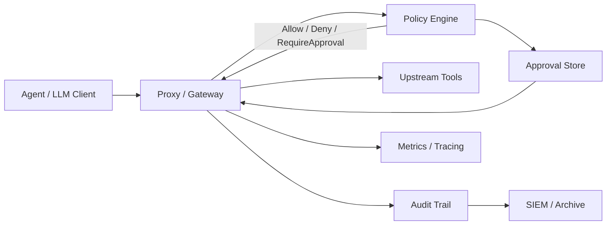
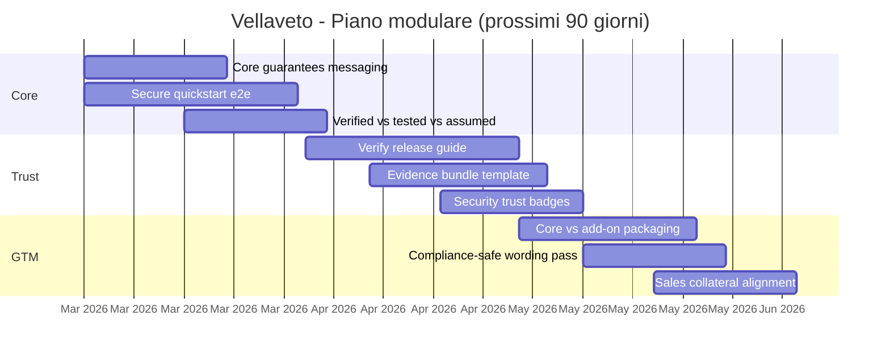

# Revisione Strategica e Tecnica di Vellaveto

Documento di lavoro per posizionamento, fiducia e crescita.

## Sintesi esecutiva

Vellaveto ha gia un nucleo tecnico forte:

- enforcement inline tra agente e tool
- policy fail-closed
- audit tamper-evident verificabile
- contratto di sicurezza pubblico con evidence riproducibile

Per accelerare adozione enterprise senza diluire il messaggio, la direzione consigliata e:

1. focalizzare il core su `enforce + block + prove`
2. modularizzare le aree piu "platform" (discovery, projector, dashboard, compliance packs)
3. rendere la fiducia verificabile con workflow "verify release" e evidence bundles
4. mantenere messaging compliance rigoroso: supporto alla compliance, non certificazione automatica

## Obiettivo di prodotto

Definire Vellaveto come:

> runtime security firewall per tool-calls agentiche, con enforcement deterministico e prova crittografica ex-post.

## Core vs add-on

### Core (sempre in primo piano)

- complete mediation su request/response path
- decisione policy fail-closed
- audit tamper-evident (hash chain + checkpoint) con verifica offline
- security contract pubblico (`docs/SECURITY_GUARANTEES.md`, `docs/ASSURANCE_CASE.md`)

### Add-on (moduli/pack)

- human approval avanzato e governance estesa
- discovery/projector
- compliance evidence packs (EU AI Act, SOC 2, ecc.)
- integrazioni enterprise (SIEM, OPA, OTLP, piattaforme di observability)

## Posizionamento raccomandato

Messaggio sintetico:

- Enforce: policy runtime inline
- Block: default deny e fail-closed
- Prove: audit verificabile e riproducibile

Messaggi da evitare:

- "compliant by default"
- "SOC 2 certified out-of-the-box"
- "previene ogni attacco"

Messaggi consigliati:

- "supporta readiness e raccolta evidenza per programmi di compliance"
- "fornisce guardrail operativi e tracciabilita verificabile"

## Stato attuale: punti forti e gap

### Punti forti

- contratto di sicurezza esplicito
- assurance case con claim -> evidence -> reproduce
- formal specs e proof artifacts (TLA+/Alloy/Lean)
- CI con gate robusti (fmt, clippy, test, supply chain checks)
- release metadata per fiducia supply-chain (SBOM/provenance)

### Gap prioritari

- rendere piu semplice il percorso di adozione iniziale (quickstart orientato outcome)
- trasformare le prove tecniche in messaggi comprensibili per buyer non specialistici
- mantenere i claim compliance strettamente controllati nel wording

## Architettura target (messaging)

## Piano operativo (0-90 giorni)

### Fase 1 (0-30 giorni): focus core

- consolidare README con sezione "Core guarantees"
- pubblicare "15-minute secure start" end-to-end
- pubblicare pagina "What is verified vs tested vs assumed"

### Fase 2 (30-60 giorni): fiducia verificabile

- aggiungere guida "verify release artifacts" (SBOM + provenance + checksum)
- standardizzare evidence bundle per buyer enterprise
- aggiungere badge e segnali di maturita security nel repository

### Fase 3 (60-90 giorni): packaging e GTM

- separare chiaramente moduli core/add-on in docs e feature flags
- definire pacchetti commerciali: core license + evidence pack + services
- allineare il linguaggio compliance in sito, README, docs e materiali sales

## Gantt indicativo

## Backlog esecutivo iniziale

| ID | Iniziativa | Output | Priorita | Sforzo | Stato |
|---|---|---|---|---|---|
| SR-01 | Core guarantees in homepage docs | README + sito allineati | Alta | M | Done (README) |
| SR-02 | Secure quickstart 15 min | tutorial end-to-end | Alta | M | Done (`docs/SECURE_QUICKSTART_15_MIN.md`) |
| SR-03 | Verify release guide | playbook verifiche artifact | Alta | M | Done (`docs/VERIFY_RELEASE_ARTIFACTS.md`) |
| SR-04 | Verified/Tested/Assumed matrix | pagina dedicata | Alta | S | Planned |
| SR-05 | Compliance wording pass | linee guida linguistiche | Alta | S | Planned |
| SR-06 | Core vs add-on map | tabella moduli ufficiale | Media | M | Planned |
| SR-07 | CI supply-chain gate utilita costante | cargo-vet o fallback cargo-deny | Alta | S | Done (`.github/workflows/ci.yml`) |

## Definition of done per iniziativa

- output documentato in `docs/`
- comandi riproducibili inclusi
- nessun claim assoluto non verificabile
- link espliciti a evidence tecniche quando presenti
- update README index

## Prossimi passi consigliati

1. SR-04: pubblicare la matrice "Verified vs Tested vs Assumed" con link puntuali a prove formali e test.
2. SR-05: allineare wording compliance (AI Act/SOC 2) in README, docs e materiali commerciali.
3. SR-06: aggiungere tabella ufficiale "core vs add-on" con feature flags e ownership crate.
